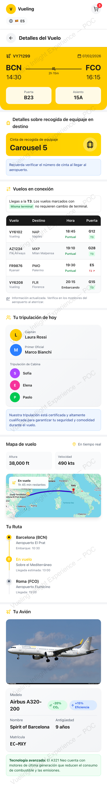
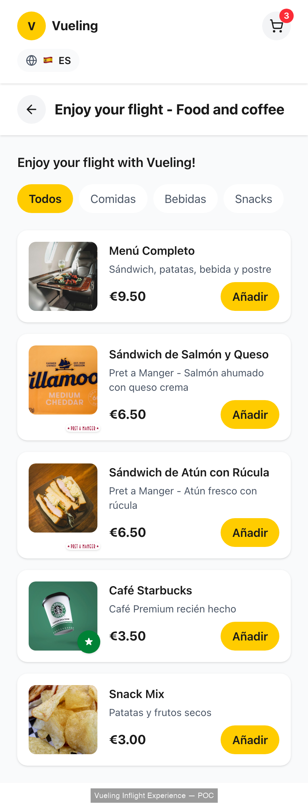
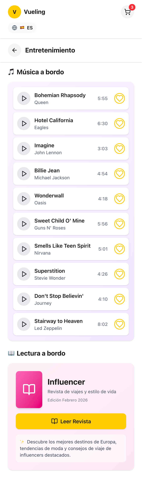
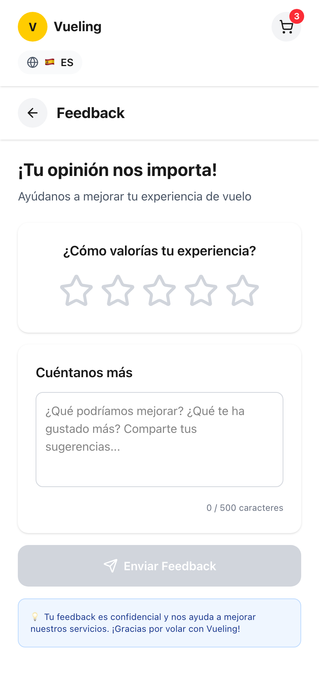

# Vueling Inflight Experience
### MWC Barcelona 2026

---

## SLIDE 1 — THE PROBLEM

**34 million passengers. 60 million hours. Zero digital engagement.**

A passenger boards a Vueling flight. They put on headphones. They switch to airplane mode. For the next two hours, they stare at their own phone with no content, no connection, and nothing from us.

When they're hungry, they wait for a cart. When they have a question, they flag down a crew member. When they land, they google their destination on someone else's platform.

We own the most captive audience in travel. We do nothing with it.

---

## SLIDE 2 — THE VISION

**One booking number. One complete experience.**

A digital platform — inside the Vueling app — that gives every passenger personalized content, food ordering, flight info, and self-service help. AI-powered. In their language. Works in airplane mode.

Content is pre-cached on the device 24h before the flight. No WiFi needed. The only things that touch satellite are food orders, payments, and the flight tracker — totaling ~370 KB per flight.

---

## SLIDE 3 — THE PRODUCT

**11 pillars. One screen. Everything a passenger needs.**

| Pillar | What It Delivers |
|---|---|
| **Food & Snacks** | Pre-order or order onboard. Tap, pay, crew delivers. |
| **Flight Details** | Aircraft name, crew names, baggage carousel, connections. |
| **Live Tracker** | Real-time map, altitude, speed, ETA. |
| **Destination** | Top highlights + restaurant picks. AI-generated, in your language. |
| **Transport** | Train, bus, taxi — times, costs, bookable transfers. |
| **Weather & News** | 3-day forecast + curated local news. |
| **Music** | Destination playlists — local artists, mixed decades. |
| **Magazine** | Ling reborn digital. Travel stories and tips. |
| **FAQ & Help** | Searchable Vueling FAQ. No crew needed. |
| **Connecting Flights** | Next gate, terminal, transfer time — before you land. |
| **Emergency** | Police, hospital, Vueling helpline. Always at hand. |

---

## SLIDE 4 — THE POC (Live Screenshots)

**This is not a mockup. This is working software.**

Demo: Angel Garcia, VY71299, Barcelona → Rome, Spanish.

### Home Screen
> Welcome screen with flight card (VY71299, BCN → FCO, 1h 45m), airplane mode advisories, and navigation to all pillars.


### Flight Details
> Full flight info: departure/arrival, seat, baggage carousel, connecting flights, crew (Captain Laura Rossi), aircraft (Airbus A320 "Spirit of Barcelona"), and live map.



### Destination Guide
> Weather, top 5 highlights (Colosseum, Trevi Fountain, Vatican...), restaurant picks, emergency contacts — all AI-generated in Spanish.


### Food & Snacks
> Digital menu with photos. Menú Completo €9.50, sandwiches, coffee, snacks. Tap "Añadir" to cart, crew delivers to seat.



### Entertainment
> Music playlists + digital magazine. Curated per destination.



### Getting to the City
> Transport from FCO to Rome: Leonardo Express (€14, 32 min), Regional train (€8), Uber (€45), bus (€6). Bookable links.


### Feedback
> Post-flight NPS survey. Star rating + open text. Confidential.



---

## SLIDE 5 — ARCHITECTURE

**Offline-first. Pre-computed. Minimal satellite.**

Nothing is generated on the fly. Content is produced on schedules, cached, and pushed before boarding.

```
  ┌─────────────────────────────────────────────────────┐
  │         CONTENT GENERATION (Scheduled)               │
  │  Gemini AI → destinations, weather, news, transport  │
  │  Airline ops → flights, crew, connections             │
  └──────────────────────┬──────────────────────────────┘
                         │
                         v
  ┌─────────────────────────────────────────────────────┐
  │              CONTENT STORE (CDN)                     │
  └────────┬─────────────────────────────┬──────────────┘
           │                             │
    ┌──────┴──────┐              ┌───────┴───────┐
    │ SILENT PUSH │              │ ONBOARD EDGE  │
    │ (App, T-24h)│              │ CACHE (WiFi)  │
    └──────┬──────┘              └───────┬───────┘
           │                             │
  ┌────────┴─────────────────────────────┴──────────────┐
  │          PASSENGER DEVICE (App or Browser)           │
  │          Works in airplane mode                      │
  └──────────────────────┬──────────────────────────────┘
                         │ only real-time (~370 KB/flight)
  ┌──────────────────────┴──────────────────────────────┐
  │   SATELLITE: flight tracker │ food orders │ payments │
  └─────────────────────────────────────────────────────┘
```

**AI Engine:** Google Gemini 2.5 Flash. One model generates all content across 6 languages. Cost: ~€0.005 per passenger.

**POC stack:** React + Vite frontend → FastAPI + Gemini backend. Fallback-first: if the API fails, pre-computed data loads. The demo never breaks.

---

## SLIDE 6 — BUSINESS IMPACT

**The food pillar alone pays for the platform.**

| | Metric | Number |
|---|---|---|
| **Revenue** | Food pre-order (8% of 34M pax × €10) | **~€27M/year** |
| **Revenue** | AOV uplift (digital menu vs. cart) | **+30%** |
| **Operations** | Crew aisle time reduction | **-15%** |
| **Operations** | Crew repetitive questions reduction | **-40%** |
| **Sustainability** | Food waste reduction | **-20%** |
| **Cost** | AI content per passenger | **€0.005** |
| **ROI** | Food revenue vs. AI cost | **160x–240x** |

---

## SLIDE 7 — ROADMAP

| Phase | What | When |
|---|---|---|
| **POC** ✅ | 3 cities, 6 languages, full UI + API, live demo | **Now** |
| **Phase 1** | Food ordering, flight tracker, magazine, FAQ, offline mode | 2026 |
| **Phase 2** | Music, payments, full route network | 2026 |
| **Phase 3** | Hyperpersonalization — remembered preferences, loyalty | Late 2026 |
| **Phase 4** | Commerce — bookable restaurants, transfers, predictive catering | 2027 |

---

## SLIDE 8 — LIVE DEMO

**Angel Garcia, seat 14D, VY71299 Barcelona → Rome**

_[Live API call + UI walkthrough]_

One booking number. One API call. A complete inflight experience.

---

## SLIDE 9 — CLOSE

**Every flight is a canvas. Every passenger is an audience of one.**

The POC is built. The architecture works. The business case is clear.

Let's build the future of flying.

**Vueling Inflight Experience — MWC Barcelona 2026**
