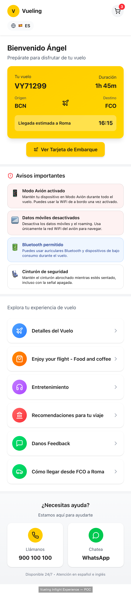
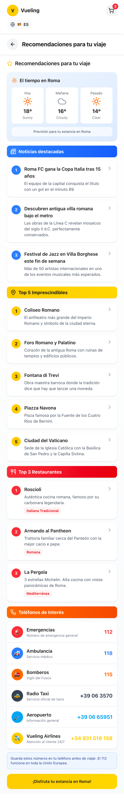

# Vueling Inflight Experience

**MWC Barcelona 2026** | Author: Ángel García | jangelgarciapena@gmail.com

**NextGen Aviation Challenge** — The future of airline customer experience: making the inflight experience great 🚀

An AI-powered digital platform that turns every Vueling flight into a personalized journey — content, entertainment, food ordering, and passenger intelligence — from one booking number and one passenger.

---

## Documents

| Document | Description |
|---|---|
| **[Vision, Business Case & POC](Vueling%20Inflight%20Experience%20-%20Vision%2C%20Business%20Case%20%26%20POC.md)** | The complete document — problem, vision, 10 pillars, business impact, architecture, roadmap, and POC scope. **Start here.** |
| **[Presentation (Figma)](https://www.figma.com/make/M2GcwUMtcxPQUgax9Yu5I0/Vueling---Infight-Experience----Feb-20026POC?p=f&fullscreen=1)** | Visual presentation of the Vueling Inflight Experience POC. |
| **[Presentation Deck](Vueling-Inflight-Experience-Feb-2026-POC-Deck.md)** | Text version of the deck — same content, no visual format. |

---

## Related repositories

| Repo | What |
|---|---|
| [inflight-poc](../inflight-poc) | Backend API — Python / FastAPI / Gemini AI |
| [inflight-ui-poc](../inflight-ui-poc) | Frontend UI — React / Vite / TypeScript |

---

**Status:** POC complete — ready for MWC demo

---

## Sneak peek

 &nbsp;&nbsp; 
